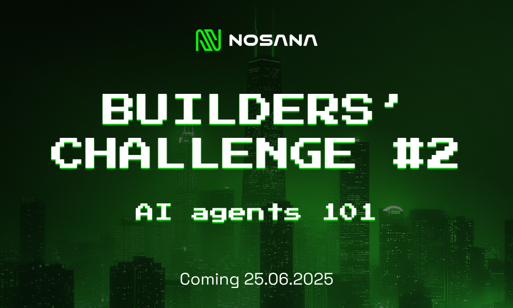

# Nosana Builders Challenge: Agent-101



## Topic

Nosana Builders Challenge, 2nd edition
Agent-101: Build your first agent

## Description

The main goal of this `Nosana Builders Challenge` to teach participants to build and deploy agents. This first step will be in running a basic AI agent and giving it some basic functionality. Participants will add a tool, for the tool calling capabilities of the agent. These are basically some python functions, that will, for example, retrieve some data from a weather API, post a tweet via an API call, etc.

## [ Mastra ] (<https://github.com/mastra-ai/mastra>)

For this challenge we will be using Mastra to build our tool.

> Mastra is an opinionated TypeScript framework that helps you build AI applications and features quickly. It gives you the set of primitives you need: workflows, agents, RAG, integrations, and evals. You can run Mastra on your local machine, or deploy to a serverless cloud.

## Get Started

To get started run the following command to start developing:
We recommend using [pnpm](https://pnpm.io/installation), but you can try npm, or bun if you prefer.

```sh
pnpm install
pnpm run dev
```

### LLM-Endpoint

Nosana will be providing an LLM-Endpoint, you are welcome to use your own, this can be changed in `.env`

## Assignment

### Challenge Overview

Welcome to the Nosana AI Agent Hackathon! Your mission is to build and deploy an AI agent on Nosana. While we provide a weather agent as an example, your creativity is the limit. Build agents that:

- Deploy and manage applications on Nosana
- Monitor blockchain activities
- Automate trading strategies
- Create content generation tools
- Build data analysis assistants
- Develop customer service bots
- Or any other innovative AI agent idea!

### Getting Started

1. **Fork this repository** to your GitHub account
2. **Clone your fork** locally
3. **Install dependencies** with `pnpm install`
4. **Run the development server** with `pnpm run dev`
5. **Build your agent** using the Mastra framework

### Submission Requirements

#### 1. Code Development

- Fork this repository and develop your AI agent
- Your agent must include at least one custom tool (function)
- Code must be well-documented and include clear setup instructions
- Include environment variable examples in a `.env.example` file

#### 2. Docker Container

- Create a `Dockerfile` for your agent
- Build and push your container to Docker Hub or GitHub Container Registry
- Container must be publicly accessible
- Include the container URL in your submission

#### 3. Nosana Deployment

- Deploy your Docker container on Nosana
- Your agent must successfully run on the Nosana network
- Include the Nosana job ID or deployment link

#### 4. Video Demo

- Record a 2-5 minute video demonstrating:
  - Your agent running on Nosana
  - Key features and functionality
  - Real-world use case demonstration
- Upload to YouTube, Loom, or similar platform

#### 5. Documentation

- Update this README with:
  - Agent description and purpose
  - Setup instructions
  - Environment variables required
  - Docker build and run commands
  - Example usage

### Submission Process

1. **Complete all requirements** listed above
2. **Create a Pull Request** to this repository with:
   - All your code changes
   - Updated README
   - Link to your Docker container
   - Link to your video demo
   - Nosana deployment proof
3. **Social Media Post**: Share your submission on X (Twitter)
   - Tag @nosana_ai
   - Include a brief description of your agent
   - Add hashtag #NosanaAgentHackathon

### Judging Criteria

Submissions will be evaluated based on:

1. **Innovation** (25%)
   - Originality of the agent concept
   - Creative use of AI capabilities

2. **Technical Implementation** (25%)
   - Code quality and organization
   - Proper use of the Mastra framework
   - Efficient tool implementation

3. **Nosana Integration** (25%)
   - Successful deployment on Nosana
   - Resource efficiency
   - Stability and performance

4. **Real-World Impact** (25%)
   - Practical use cases
   - Potential for adoption
   - Value proposition

### Example Ideas

Need inspiration? Here are some agent ideas:

- **DeFi Monitor**: Track and alert on blockchain events
- **Code Review Assistant**: Analyze PRs and suggest improvements
- **Research Summarizer**: Aggregate and summarize papers/articles
- **NFT Price Tracker**: Monitor collections and alert on opportunities
- **DevOps Assistant**: Automate deployment and monitoring tasks
- **Content Creator**: Generate social media posts or blog articles
- **Data Pipeline Manager**: Orchestrate data processing workflows

### Resources

- [Nosana Documentation](https://docs.nosana.io)
- [Mastra Documentation](https://mastra.ai/docs)
- [Nosana CLI](https://github.com/nosana-ci/nosana-cli)
- [Docker Documentation](https://docs.docker.com)
- [Example Weather Agent](src/mastra/agents/weather-agent.ts)

### Support

- Join [Nosana Discord](https://discord.gg/nosana) for technical support
- Check the [Nosana Forum](https://forum.nosana.io) for discussions
- Follow [@nosana_ai](https://x.com/nosana_ai) for updates

### Important Notes

- Ensure your agent doesn't expose sensitive data
- Test thoroughly before submission
- Keep your Docker images lightweight
- Document all dependencies clearly
- Make your code reproducible

Good luck, builders! We can't wait to see the innovative AI agents you create for the Nosana ecosystem.
